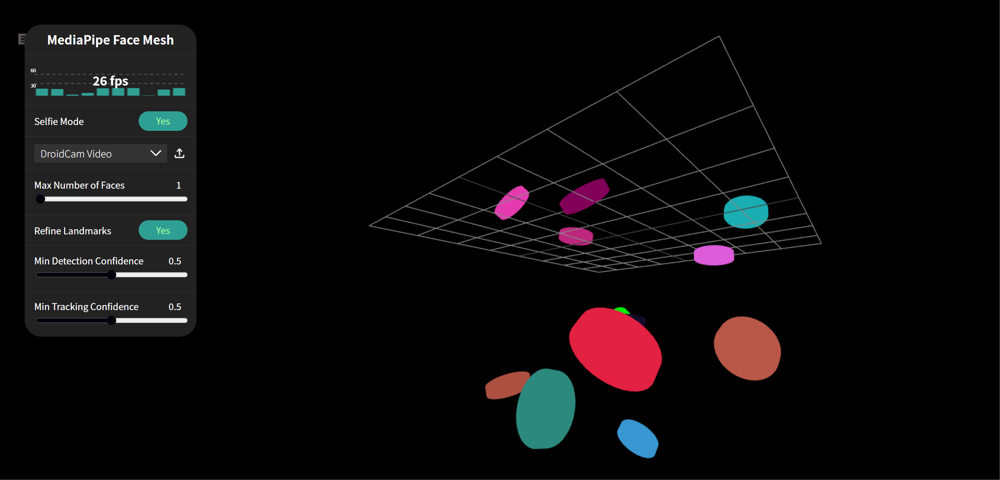

# Web-Naked-Eye-3D

This is a web demo roughly implements naked-eye 3d.

Quick experience on CodePen: [CodePen Demo](https://codepen.io/Exisfar/pen/EajKyPX)



## How to Use:

Run the command below to start a local server:

```sh
npx serve .
```

## Related techniques:

- Off-axis perspective projection
- Eye tracking
- Three.js

## Reference

- [Could we make the web more immersive using a simple optical illusion?](https://shopify.github.io/spatial-commerce-projects/WonkaVision/)
- [MediaPipe - Face Mesh - iris distance](https://codepen.io/Susanne-Thierfelder/pen/yLEOQXq)
